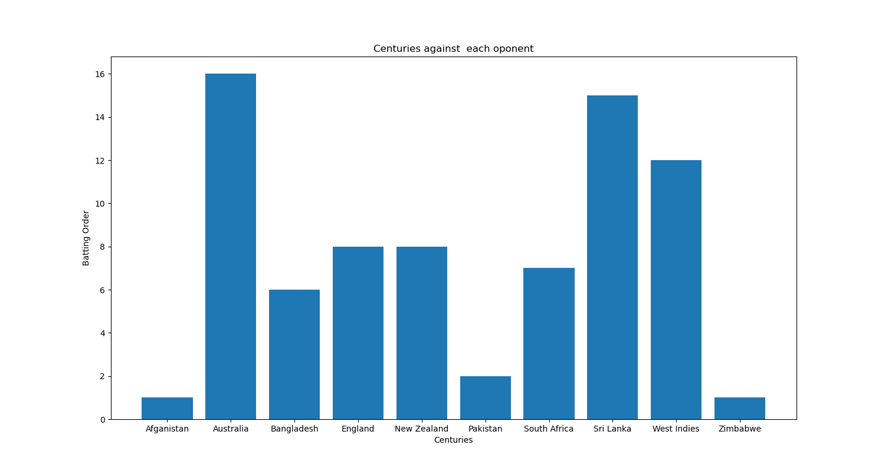
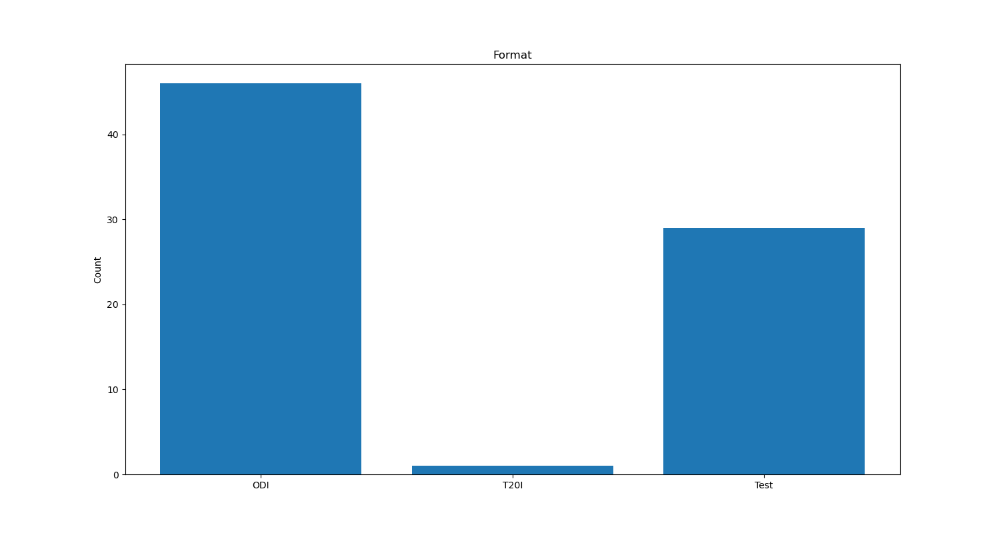
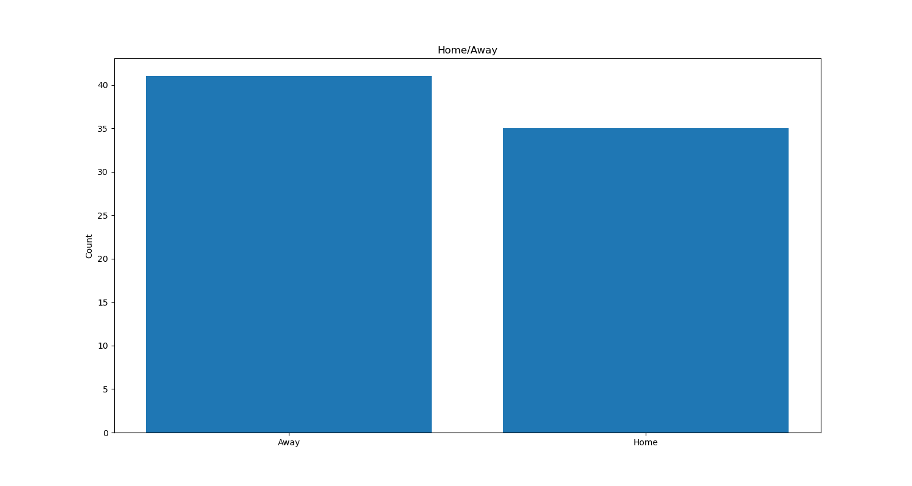
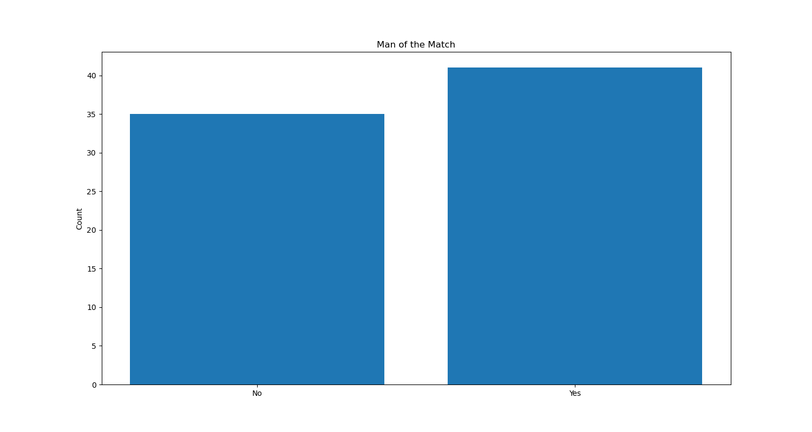
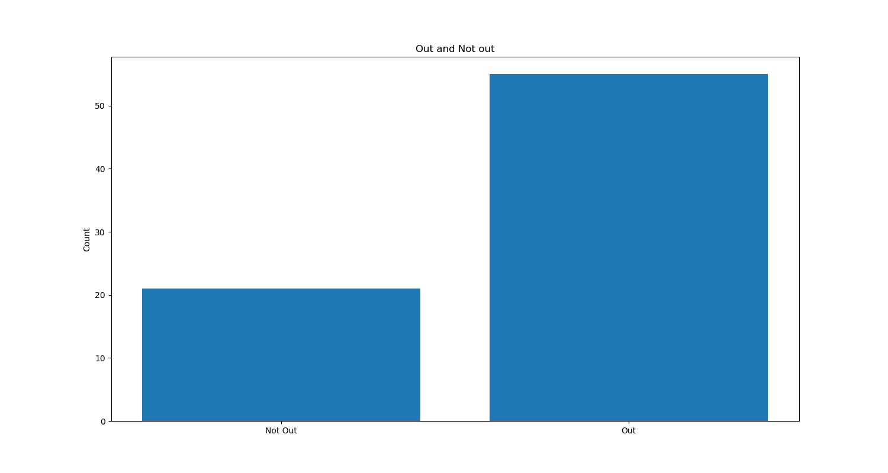
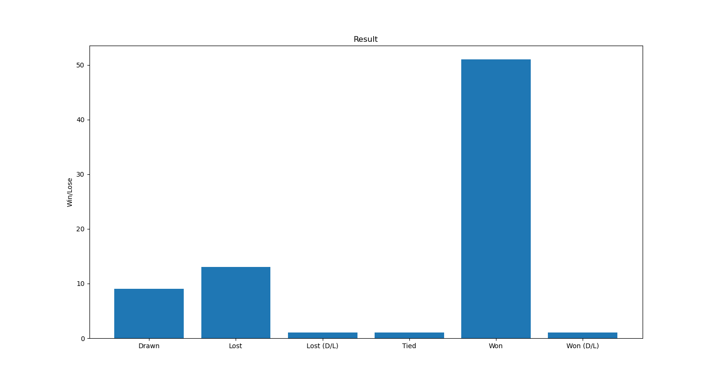

# Virat Kohli Centuries Data Visualization

Welcome to the Virat Kohli Centuries Data Visualization project repository! This project showcases an in-depth data analysis and visualization of Virat Kohli's remarkable century achievements using Python's powerful libraries: NumPy, Pandas, and Matplotlib.

## About the Project

In this project, we explore Virat Kohli's century data across different formats and matches. By utilizing data manipulation, cleaning, and visualization techniques, we gain valuable insights into Virat Kohli's performance over the years.

## Features

- **Data Cleaning:** Processed and prepared the dataset for accurate analysis.
- **Data Visualization:** Utilized Matplotlib to create interactive and insightful visualizations.

## Getting Started

To explore and run this project on your local machine, follow these steps:

1. Clone the repository: `git clone https://github.com/yourusername/virat-kohli-centuries-data-visualization.git`
2. Navigate to the project directory: `cd virat-kohli-centuries-data-visualization`

## Project Structure

- `images/`: Contains the images and screenshots used in the project.
- `/`: Contains the dataset CSV files.
- `/`: Jupyter notebooks for data analysis and visualization.

## Visualizations

## Contributing

Contributions are welcome! If you'd like to enhance the project or add new features, feel free to fork this repository and submit a pull request.

## License

This project is licensed under the MIT License - see the [LICENSE](LICENSE) file for details.

---

Let's explore Virat Kohli's incredible journey through the lens of data! 🏏📊🚀

\*Disclaimer: This project is for educational purposes and is not affiliated with or endorsed by Virat Kohli or any cricket organization.
